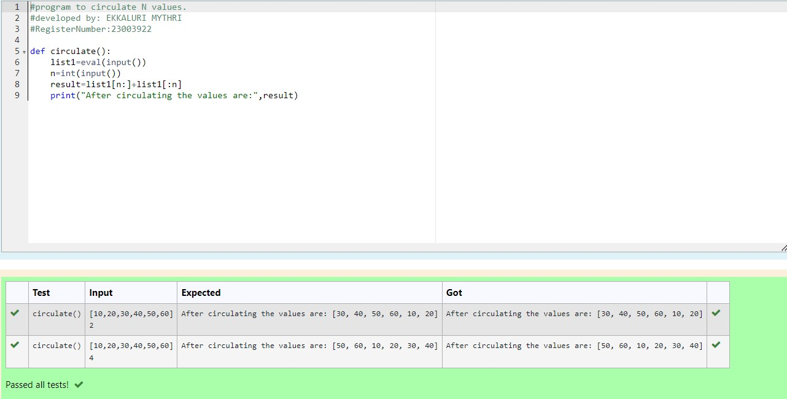

# Circulate-the-values-of-N-variables
## Aim:
To write a python program to circulate the n variables using function concept
## Equipment’s required:
PC
Anaconda - Python 3.7
## Algorithm: 
### Step 1: 
start the program
### Step 2:
Get the input from the user using eval(input()) 
### Step 3: 
Get the value from the user for the number of rotation
### Step 4: 
Using the slicing concept rotate the list

### Step 5:
using concatenation operation display the entire rotated list 
### Step 6: 
stop the program
## Program:
``````
#program to circulate N values.
#developed by: EKKALURI MYTHRI
#RegisterNumber:23003922

def circulate():
    list1=eval(input())
    n=int(input())
    result=list1[n:]+list1[:n]
    print("After circulating the values are:",result)
``````

## Output:


## Result:
Thus the python program for circulate the value of n variable is executed sucessfully..
